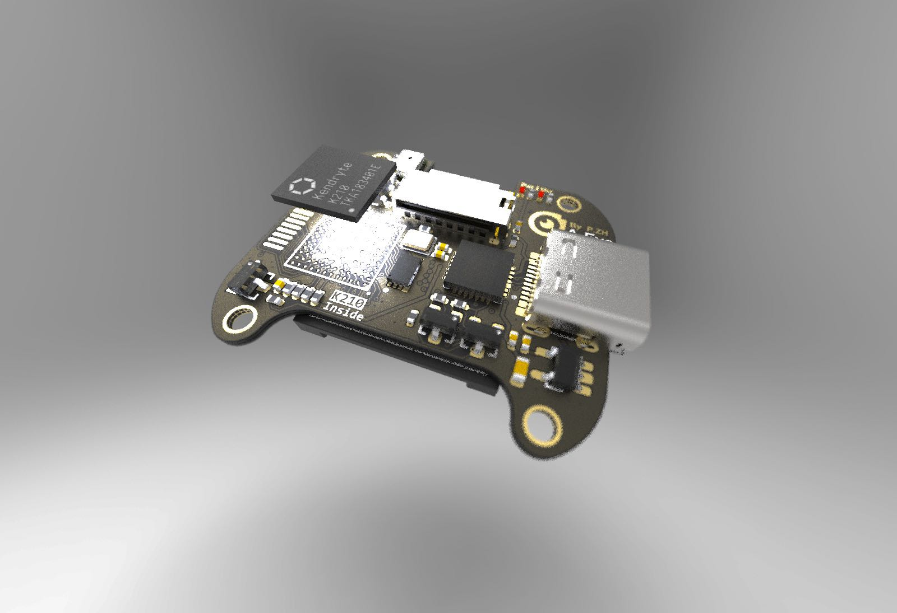
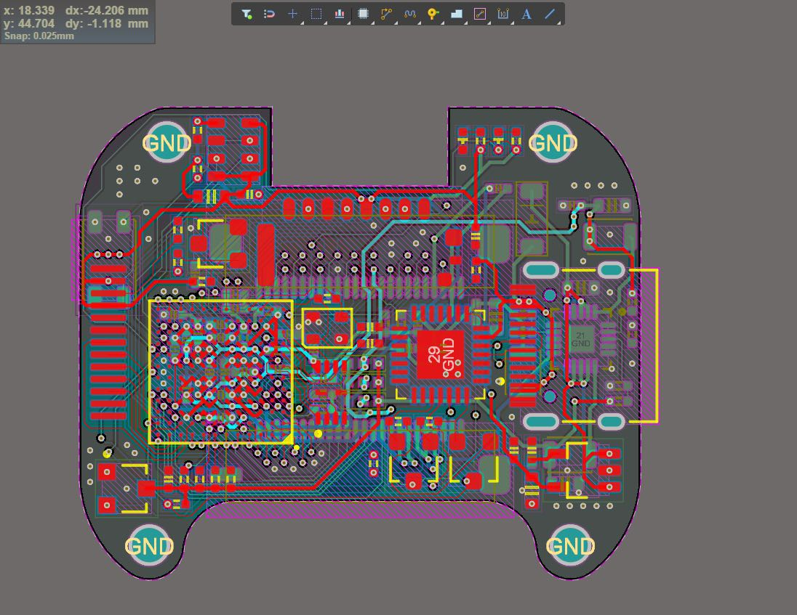

# 超迷你的智能摄像头A-Eye
> 这是一个基于K210的超迷你开发板，软硬件完全开源。

* 关于K210的介绍可以参考我知乎的这篇文章：

  [嵌入式AI从入门到放肆【K210篇】-- 硬件与环境](https://zhuanlan.zhihu.com/p/81969854)

* 视频演示可以看这个：

  https://www.bilibili.com/video/av70319783/


### 1.硬件

PCB和外壳的设计效果：






### 2.软件

软件是基于Kendryte IDE开发的，整个firmware文件夹就是工程。


### 3.教程

> 什么时候出教程？

母鸡呀。

上面的文章是基础介绍可以先看看，详细的项目教程要等我过阵子有空了整理，如果大家有K210开发基础的话可以自己先尝试玩玩，愿意分享经验的也可以联系我帮你推广。


### 4.工具

tools目录下有图片取模小工具**A-Eye-Image2array.py**,可以将图片转成C数组.

该工具以子模块的形式存在于项目中,拉取项目时请使用以下命令,以确保拉取完整.
```bash
git clone --recursive https://github.com/david-pzh/A-Eye.git
```

使用方法:
```bash
python A-Eye-Image2array.py A_Eye.jpg
```

示例:

